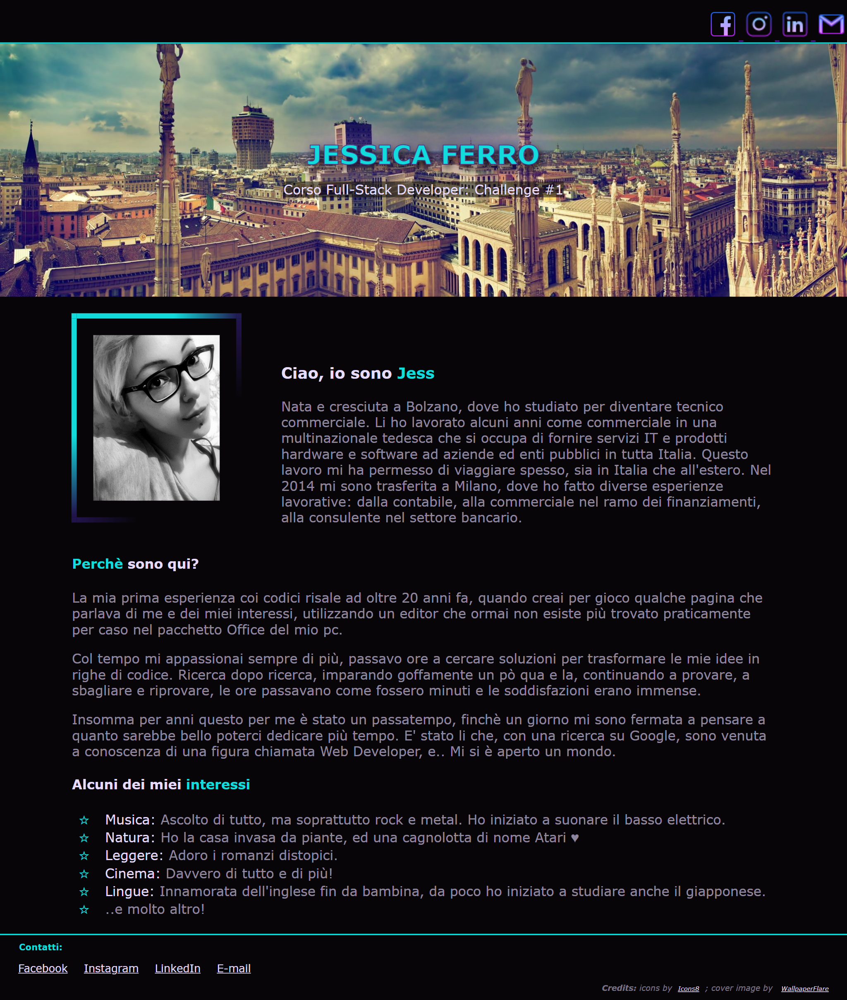
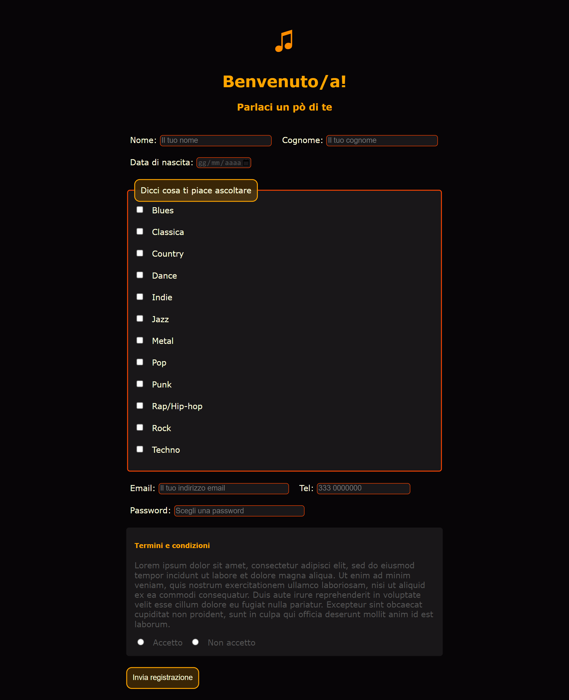
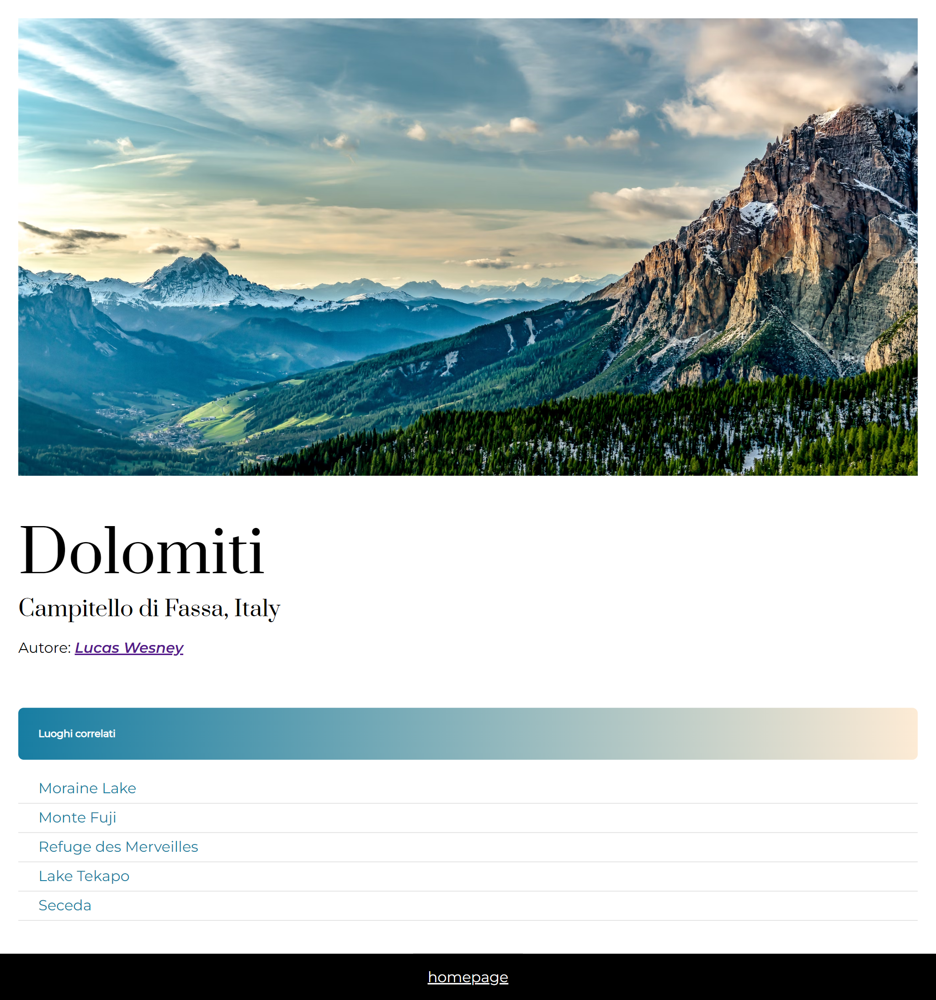
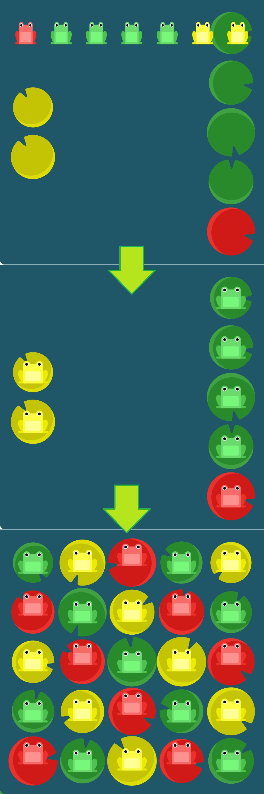
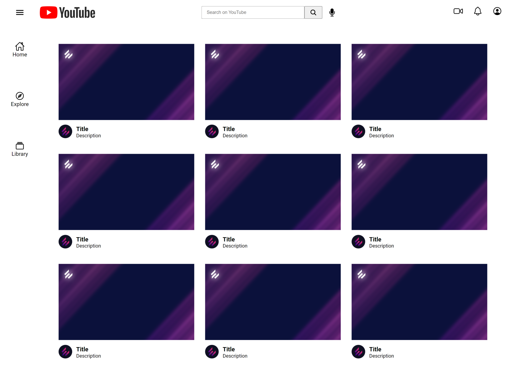

# Ehilà 👋
### E' bello vederti!

Qui trovi i risultati delle mie **Challenges** per il **pre-corso Web Developer** di Epicode.

## Eccoti le anteprime:

Challenge 1: HTML Basics

🗂️ [vai ai dettagli](./01_HTML_Basics)

Challenge 2: Frontend Basics

🗂️ [vai ai dettagli](./02_Frontend_Basics)

Challenge 3: CSS Basics

🗂️ [vai ai dettagli](./03_CSS_Basics)

Challenge 4: Flexbox 

🗂️ [vai ai dettagli](./04_Flexbox)

Challenge 5: YouTube Clone 

🗂️ [vai ai dettagli](./05_YouTube_Clone)

